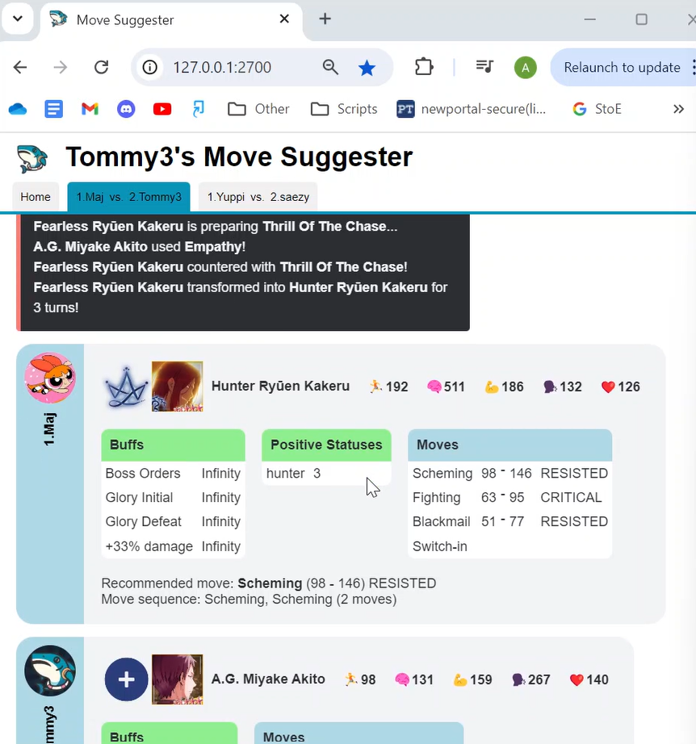

# Gacha Suggest Moves
The goal of this project is to create a program that will view battles in real-time and make suggestions for what move to make based on the stats of the characters in each party.

The first thing you'll need to do is download MongoDB on Windows (I haven't tried downloading MongoDB on other Operating Systems) and make a MongoDB database. Name it "BattleData" and create collections "CharacterData", "ImageData", "UserCollections", and "BattleLogs" within it, like below (Note: you do not need the "Interactions" or "CriticalInteractions" collections):


You can then add data to the collections by importing the data stored in this repository's databaseCollections folder. You can also add more data to your database by running the scripts in the updateDatabase folder- just follow the instructions at the top of the files.

Create a file named "config.json" that is formatted as follows:
```
{
    "token": "your Discord authorization token here",
    "ipAddress": "127.0.0.1 if you're using windows, or the output of $ ip route show | grep -i default | awk '{ print $3}' if you're running on WSL",
    "privateThread": "the id of the private thread you request parties in"
}
```

Create a "currentBattles" directory, and create a "battleAssets" directory inside the webpage directory. Whenever a battle occurs in a channel you have permission to view, recommendations will be printed to the corresponding file in the currentBattles directory.

Install all required node modules with:
```
$ npm install
```

Once you have all that set up, you can run the program by running these two commands in separate terminals:
```
$ node 1.server.mjs
$ node 2.driver.mjs
```

Once the server and driver are running, you can open 127.0.0.1:2700 in your browser and view suggestions on current battles.

